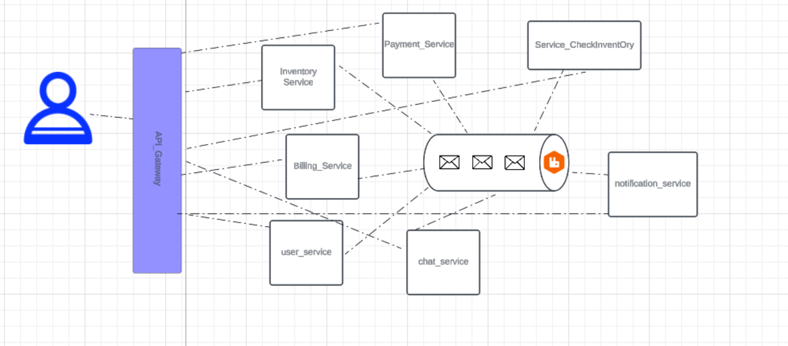

# Description du Projet E-commerce

Le projet e-commerce repose sur une architecture microservices, chaque service étant responsable d'un aspect spécifique du processus de vente en ligne. Cette approche permet une meilleure scalabilité et une gestion indépendante des différents services. Le projet est développé avec Node.js, Express pour la gestion des services back-end, React.js pour l'interface front-end, et la communication entre les services se fait via des API REST. Pour la gestion des données, MongoDB et MySQL sont utilisés en fonction des besoins spécifiques de chaque service. Voici les principaux services de l'application :

## Objectif du projet

Ce projet e-commerce vise à offrir une plateforme de vente en ligne moderne et flexible, capable de gérer plusieurs catégories de produits, de traiter efficacement les paiements, et de fournir un suivi en temps réel des commandes. L'architecture microservices assure une évolutivité et une maintenance optimisées, permettant ainsi une gestion efficace des différents processus du système.

L'accent est mis sur la simplicité d'utilisation, la rapidité de traitement des commandes, et la sécurité des transactions. Grâce à l'usage d'API REST et de RabbitMQ pour la gestion de la communication asynchrone entre les services, le projet peut être facilement déployé et mis à jour avec des méthodes modernes de gestion de l'infrastructure.

## Services :

- **Service Utilisateur (User Service)** : Gère l'authentification et l'autorisation des utilisateurs, ainsi que la gestion de leurs informations personnelles et de leurs commandes.
- **Service de Commande (Order Service)** : Responsable de la gestion des commandes, de leur création jusqu'à la livraison.
- **Service d'Inventaire (Inventory Service)** : Permet de suivre les stocks disponibles, et ajuste la disponibilité des produits en temps réel.
- **Service de Vérification des Stocks (Check Inventory Service)** : Assure qu'il y a suffisamment de stock pour satisfaire une commande avant de la valider, et met à jour les informations sur les produits dans l'inventaire.
- **Service de Facturation (Billing Service)** : Calcul des montants des commandes, gestion des taxes, et émission de factures.
- **Service de Notification (Notification Service)** : Envoie des notifications de mise à jour des commandes via email, SMS, ou push notifications.
- **Service de Réduction (Discount Service)** : Applique des réductions ou offres spéciales à la commande, selon les critères définis.
- **Service de Chat (Chat Service)** : Permet la communication en temps réel avec les clients pour répondre à leurs questions et fournir de l'assistance.
- **Service de Paiement (Payment Service)** : Gère les paiements en ligne sécurisés via des solutions comme PayPal, Stripe, et cartes bancaires.

## Technologies utilisées

- **Back-end** : Node.js, Express
- **Front-end** : React.js
- **Base de données** : MongoDB, MySQL
- **API** : RESTful API pour la communication entre les services
- **Message Queue** : RabbitMQ pour la gestion des messages asynchrones entre les services

Le projet vise à offrir une solution flexible, évolutive et sécurisée pour gérer efficacement les transactions d'un site e-commerce tout en garantissant une expérience utilisateur fluide et rapide.
